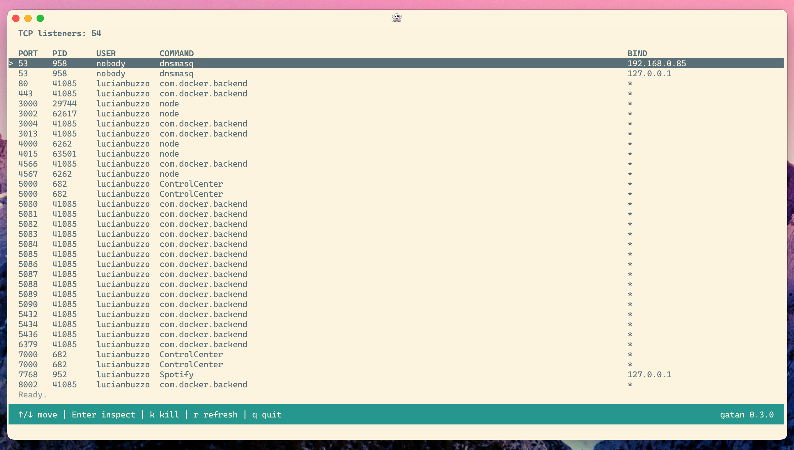
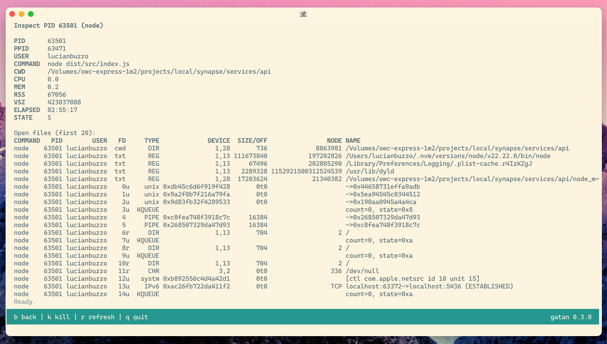
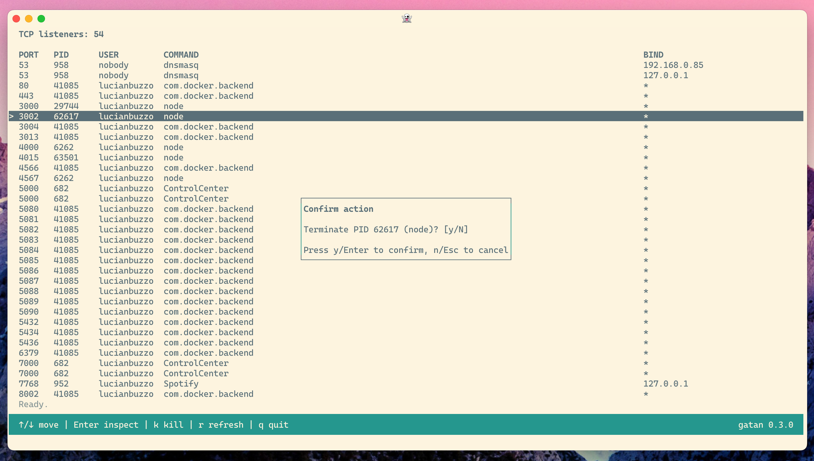

I keep hitting the same tiny annoyance on my Mac: some dev server grabs a port, I forget where it came from, and then I burn five minutes doing the `lsof | grep | awk | kill` dance.

That annoyance became [gatan](https://github.com/LucianBuzzo/gatan): a small terminal UI that shows listening TCP processes, lets me inspect details, and kill a process safely.



I wanted this to feel quick and native in a terminal, so I built it in Bash rather than pulling in a larger runtime.

## Goals and constraints

I set a few constraints early:

- **macOS-first**
- **Bash-first** (no big runtime dependency)
- **Fast key handling** (should feel immediate, not laggy)
- **Safe kill flow** (`SIGTERM` first, `SIGKILL` only if needed)
- **Release/CI hygiene from day one**

The first big commit bootstrapped all of that in one go: app structure, tests, CI linting, and release automation.

## The core loop

At the center of gatan is a simple idea:

1. Use `lsof` to collect listening TCP processes.
2. Normalize those rows.
3. Render them in a full-screen TUI.
4. Keep refreshing in the background while the user navigates.

One tiny detail that mattered more than expected: command names from `lsof` can be truncated by default. I hit that early and fixed it by asking for full command names with `+c 0`.

```bash
core_raw_lsof() {
  # `+c 0` asks lsof for full command names (no default 9-char truncation).
  sudo lsof +c 0 -nP -iTCP -sTCP:LISTEN 2>/dev/null
}
```

That one flag made the UI materially more useful.

## The annoying macOS Bash 3.2 problem

One of the least glamorous bugs was also one of the most important: macOS system Bash (3.2) does not support fractional `read` timeouts the way newer Bash versions do.

If you build keyboard handling around sub-second timeouts and forget that, input starts behaving weirdly on default macOS setups.

So I added a compatibility layer to coerce fractional timeouts when running on older Bash.

```bash
ui_read_timeout() {
  local timeout="${1:-1}"

  # macOS system bash 3.2 only accepts integer read timeouts.
  if [ "${BASH_VERSINFO[0]:-0}" -lt 4 ] && [[ "$timeout" == *.* ]]; then
    printf '1\n'
    return 0
  fi

  printf '%s\n' "$timeout"
}
```

Not exciting, but exactly the sort of thing that makes CLI tools feel either solid or flaky.

## Making the UI feel responsive

After the first version worked, the next chunk of effort was all about responsiveness and layout polish.

I iterated through:

- frame/layout improvements
- terminal-size handling
- row truncation behavior
- confirmation modal spacing
- redraw/input performance

A meaningful change here was shifting refresh work into a background job and polling completion, rather than blocking the interface.

```bash
app_start_main_refresh() {
  APP_MAIN_REFRESH_JOB_FILE="$(mktemp "${TMPDIR:-/tmp}/gatan-main-refresh.XXXXXX")" || return 1
  (
    core_collect_sorted_listeners >"$APP_MAIN_REFRESH_JOB_FILE" 2>/dev/null || true
  ) &
  APP_MAIN_REFRESH_JOB_PID=$!
}
```

That made navigation feel much less sticky when the system was busy.

## Inspect view and kill flow

The inspect view started basic, then grew into something much more practical:

- process summary
- CWD and open files
- live metrics snapshot (CPU, memory, elapsed)



At the same time, I was opinionated about process termination:

1. Confirm `SIGTERM`
2. Wait briefly
3. If still alive, optionally escalate to `SIGKILL`

This gives a safer default without hiding the “nuke it” option when needed.

I also added a dedicated sudo explainer flow so users understand *why* elevation is needed and what gatan is doing with it.



## Shipping discipline (for a tiny tool)

Even though this is a small utility, I wanted it to ship like a real product:

- Bats tests for parsing, key handling, inspect behavior, and kill flow
- `shellcheck` + `shfmt` in CI
- Conventional Commit enforcement in PRs
- release-please for changelog + version automation

That paid off quickly: I shipped `0.2.0` and `0.3.0` within the first wave of changes, with release notes generated from actual commit history.

## Documentation was part of the build

Today I also revisited docs and added screenshot coverage to the README.

Interesting side note: I first tried automating screenshot capture directly from a controlled terminal session, but that path became fiddly fast (TTY edge-cases, environment parity, command availability). It was genuinely faster and cleaner to take the screenshots manually and wire them in.

That was a nice reminder: automation is great, but only when the setup cost is lower than just doing the work.

## What I’d improve next

If I keep iterating on gatan, I’ll probably tackle:

- filtering/search in the process list
- sorting toggles (PID, command, age)
- better tree/context around parent processes
- optional non-sudo mode with reduced data

## Closing thought

I like projects like this because they’re small enough to finish but deep enough to force good decisions.

gatan started as “I’m tired of checking ports manually,” but it turned into a neat little case study in Bash ergonomics, terminal UX, and release discipline.

If you want to try it, you can install it with:

```bash
bpkg install -g lucianbuzzo/gatan
```

Source code: [https://github.com/LucianBuzzo/gatan](https://github.com/LucianBuzzo/gatan)
