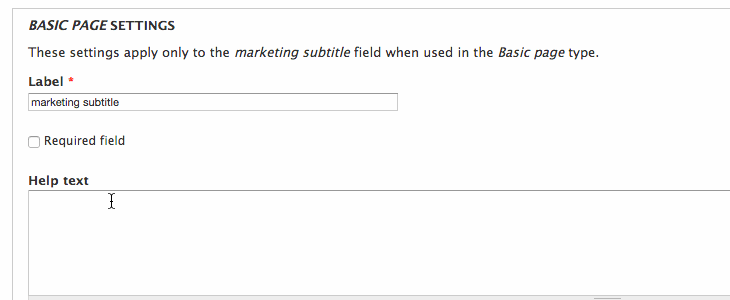
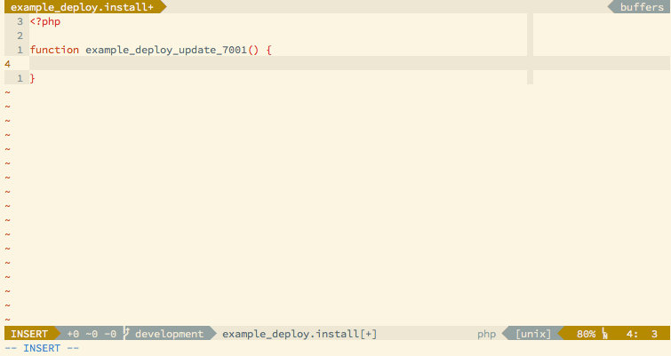

In Drupal 7, deploying new fields from a development environment onto a production server can
be a tricky and time consuming business.
Imagine, the following scenario:

  - A client requests a new subtitle text field on the sites product nodes, "for better integration of cross-selling marketing
  solutions".
  - You create the field in your development environment (MAMP, XAMP, VM etc) by firing up Chrome and clicking though the GUI.
  - You check to make sure it all looks good, adding any additional styles or
    templating.
  - Happy with the changes, you transfer your new styles and template changes to
    the production server and then login and faithfully replicate creating the
    new subtitle text field on the live site.

This process of copying changes across would probably involve putting two browser
windows side by side, one on the development site and one on the production
site and making sure that all of the field settings match.



Manually recreating fields on a production server is a tedious and error prone
business, especially when faced with the prospect of creating multiple new fields.
Ideally this process should be automated and completed in as few steps as possible.

Much of the site configuration in Drupal 7 is heavily baked into the site's
database and can be particularly cryptic to unravel. A common way of getting this
configuration into code (and therefore under version control and easily
deployable) is with the use of
the [Features][1] and [Strongarm][2] modules, but for me this isn't always
a viable option.

The process of using Features and Strongarm to deploy updates
is not simple and requires you to split the functionality of your site into
*self-contained* parts of code and configuration, which can be a length and
challenging process, especially when working on a site that doesn't
use this method for deployment.

My preferred approach in these situations is to
use a site deployment module. If you're not familiar with creating a custom
module, take a look through the [example modules][16] source code and the
excellent [developer guide][17] on drupal.org.
In short, a site deployment module is a custom
module that utilises a `.install` file to incrementally update a site. These
updates are run by implementing [hook_update_N][3], where N is the modules
current update number. A basic `.install` file for a site deployment module
can be seen on the [dcycle][4] site (a fantastic resource for Drupal automation snippets).
If I were to create a new module called "mysite_deploy" containing this code:

```php
/**
 * Example update function that disables Overlay
 */
function mysite_deploy_update_7001() {
  // some people don't like overlay...
  module_disable(array('overlay'));
}
```

I could then push the module code to my production server, enable this module
through the GUI and then run update.php by clicking on the "update script" link
on the modules page. The function `mysite_deploy_update_7001` would then run and
the overlay module would be disabled.

Using this method to create a new field is surprisingly tricky. Firstly you need
to create the new field using [`field_create_field`][5], passing
in a valid "field definition array". The you will need to create an instance for
each place that the new field is used using [`field_create_instance`][6], this
time using a "field instance definition array".

For me, this is a daunting task. The information required to create a new field
is as confusing as it is diverse and becomes even more complicated when your
trying to deploy a non-standard field such as [entity reference][7].
I'm forever forgetting what "widget type" I need to be using and what
"cardinality" actually means.

Luckily all this information is available through other Drupal API functions,
*if the field has already been created*. Using the two functions [`field_info_field`][8]
and [`field_info_instance`][9], I can add something like this to my themes
`template.php` and get all the information I need (as long as I can figure out what my entity type and bundle is).

```php
$fieldName = 'field_fancy_marketing_text';
$fieldInfo = field_info_field($fieldName);
$bundle = 'product';
$entityType = 'node';
$fieldInstance = field_info_instance($entityType, $fieldName, $bundle);
print_r($fieldInfo);
print_r($fieldInstance);
```

The problem with this method is that it's particularly brutal ([`print_r()`][10] in
template.php?) and I still need to format the printed arrays into valid PHP.
Using [`var_export`][11] instead of `print_r` helps but it all still feels a bit
clunky. It's not fast and I'm having to edit unrelated files to get the
information I need.

A better solution for me was to use a [Drush][12] script. If you haven't come
across Drush before, it is a command line tool that can bootstrap and interface
with Drupal installations in various ways, from clearing caches to updating
modules. I highly recommend it, it's become an incredibly valuable part of my
Drupal development toolkit.

After creating a field through the GUI on my development site, I can run the
Drush script from the command line, providing the field's machine name as an
argument. The script pretty prints code that I can then
copy and paste into a `hook_update_N` function.
The script uses the provided field name to call `field_info_field` and
`field_info_instance`, fetching the necessary field definition and instance
definition arrays. These arrays are then beautified and output to the command line
using the [heredoc style][13]. This script can be used 'as is' as long as it it's
run from inside a Drupal installation directory.

I've posted the complete annotated script as a [GitHub gist][14].

I love this little drush script, but for me it was still bothersome that I had
to drop out of the `.install` file I was working on, run the script and copy and
paste the output. So I wrote a Vim plugin!



Using this plugin I can type the machine name of a field, then go to normal mode
and execute the function `DrupalExportField` (or map the function call to
a leader key - in the example above I'm using the mapping `<Leader>def`). The
word under the cursor is then replaced with the PHP code generated by the drush
script. The code written into the vim buffer can have indentation that doesn't
match the rest of your file, but by executing the normal mode command `=i{` at
the end of the function we can automagically neaten up the spacing inside the
current code block.

If you like, you can copy and paste the code below into your .vimrc file or
alternatively you can download the plugin from GitHub [here][15].

```vim
" Get the absolute path of this vimscript
let s:path = fnamemodify(resolve(expand('<sfile>:p')), ':h')

function! DrupalExportField()
  " Get the word underneath the cursor
  let fieldName = expand("<cword>")
  " Get the root path of the current Drupal installation
  let drupalRoot = system("drush eval 'echo getcwd()'")
  " Execute the drush script (the script should be stored relative to this functions absolute path)
  let exportCode = system('drush --root=' . drupalRoot . ' ' . s:path . '/fieldexport.drush.php --field=' . fieldName)
  " Switch to paste mode
  set paste
  " Write the export code to the buffer, then neaten up the indentation
  execute "normal! mqciw\<F10>" . exportCode . "\<F10>\<esc>'q=i{"
  " Exit paste mode
  set nopaste
endfunction
```


[1]: https://www.drupal.org/project/features
[2]: https://www.drupal.org/project/strongarm
[3]: https://api.drupal.org/api/drupal/modules%21system%21system.api.php/function/hook_update_N/7
[4]: http://dcycleproject.org/blog/65/basic-install-file-deployment-module
[5]: https://api.drupal.org/api/drupal/modules!field!field.crud.inc/function/field_create_field/7
[6]: https://api.drupal.org/api/drupal/modules%21field%21field.crud.inc/function/field_create_instance/7
[7]: https://www.drupal.org/project/entityreference
[8]: https://api.drupal.org/api/drupal/modules!field!field.info.inc/function/field_info_field/7
[9]: https://api.drupal.org/api/drupal/modules!field!field.info.inc/function/field_info_instance/7
[10]: http://php.net/manual/en/function.print-r.php
[11]: http://php.net/manual/en/function.var-export.php
[12]: http://www.drush.org/en/master/
[13]: https://php.net/manual/en/language.types.string.php#language.types.string.syntax.heredoc
[14]: https://gist.github.com/LucianBuzzo/d892c70d045b9ce32be049ee3d0e143a
[15]: https://github.com/LucianBuzzo/vim-drupal-field-export
[16]: https://www.drupal.org/project/examples
[17]: https://www.drupal.org/developing/modules/7
