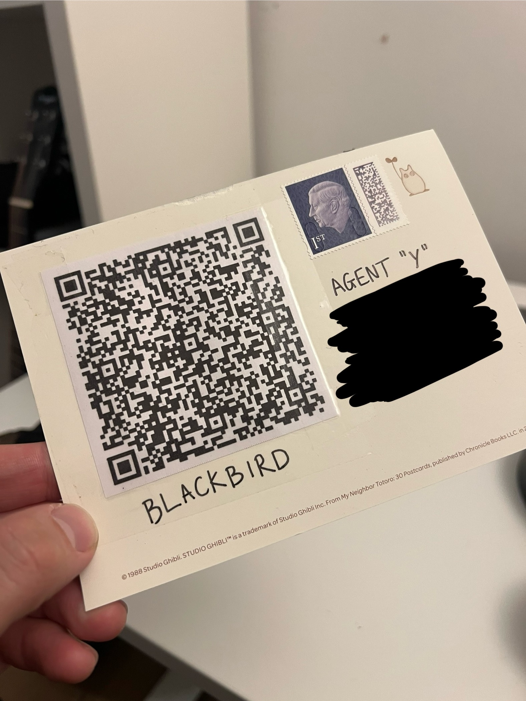
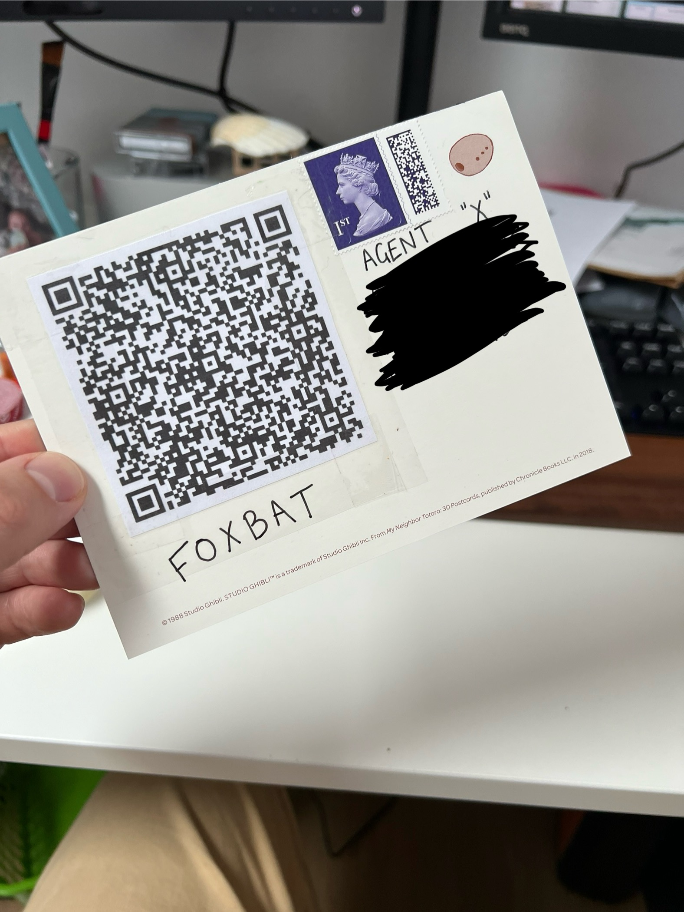

In cryptography, a one-time pad (OTP) is a type of encryption that uses a random key that is as long as the message to be encrypted. The key is used only once and then discarded. Each character of the message is encrypted using the corresponding character in the key, using [modular addition](https://en.wikipedia.org/wiki/Modular_arithmetic).
The key used would be shared between the sender and receiver ahead of time and a system would be put in place to make sure the send and receiver use the same key for encryption and decryption, e.g. use a new key for each message.

What does this look like in practice? Let's say for example that Alice wants to send a message to Bob. 
They each have a copy of the same one time pad, which is a pad of sheets of paper, each with a random sequence of numbers on it.
Each sheet of the pad acts as the encryption key and is unique and is used only once - hence the name "one time pad".

She takes the message "HELLO" and uses a one-time pad to encrypt it.
First, each character in the message is converted to a number, e.g. H = 8, E = 5, L = 12, etc.

```
Message: H E L L O
Numbers: 8 5 12 12 15
```

Then she uses the top sheet of her one time pad to encrypt the message. 

```
Key: 1 2 3 4 5
```

She takes the first character of the message, 8, and adds it to the first character of the key, 1.

```
8 + 1 = 9
```

She then takes the second character of the message, 5, and adds it to the second character of the key, 2.

```
5 + 2 = 7
```

She continues this process for the rest of the message.

```
12 + 3 = 15
12 + 4 = 16
15 + 5 = 20
```

The encrypted message is then sent to Bob.

```
Encrypted Message: 9 7 15 16 20
```

Bob receives the encrypted message and uses the matching sheet of his one time pad to decrypt it. He takes the first character of the encrypted message, 9, and subtracts it from the first character of the key, 1.

```
9 - 1 = 8
```

He then takes the second character of the encrypted message, 7, and subtracts it from the second character of the key, 2.

```
7 - 2 = 5
```

He continues this process for the rest of the message.

```
15 - 3 = 12
16 - 4 = 12
20 - 5 = 15
```

This gives him the decrypted message `8 5 12 12 15`, which can then be converted back the original message "HELLO".

After this process is complete, the key (top sheet on the pad) is discarded, and a new one used for the next message.

If the encrypted number is greater than 26 (the number of letters in the alphabet), we take the modulo of the result with 26.
For example if the character is `X` and the key is `5`, then `24 + 5 = 29`. The modulo of 29 with 26 is 3, so the encrypted character is `3`.

The power of this cipher comes from the fact that the key used is non-repeating. If the same key is used for multiple messages, the attacker can use [frequency analysis](https://lucianbuzzo.com/exploring-cryptography-frequency-analysis-pt2/) to crack the message.

# Let's build!

I love the simplicity of this cipher, so I thought it would be a fun project to build a one time pad system, but with a twist.
The concept is that I would dynamically generate the key for the one time pad using two passwords, and then use that key to encrypt and decrypt messages. This means I could send someone a message with one of the passwords, but they wouldn't be able to decrypt it without the other password. Decrypting the message would require shared knowledge. I could then send someone the encrypted message and the first password on the back of a postcard to one recipient, and the second password on the back of a postcard to another recipient, and they would need to work together to decrypt the message. I'd also like to make a web app that they could use to decrypt the messages, which should have a bit of flair to it!

To generate the key, I'll take the two passwords, concatenate them together and use them as a seed for a psuedo-random number generator. I'll then use the random number generator to generate a key of the same length as the message.
For this project I'm using the [`chance`](https://chancejs.com/usage/seed.html) library to generate the key, which uses the [Mersenne Twister algorithm](https://en.wikipedia.org/wiki/Mersenne_Twister) under the hood. 
Using a seed is important here as it means that the same two passwords will always generate the same key, and therefore the same encrypted message.

```js
const Chance = require('chance');

// Define the alphabet to use for encryption
const alphabet = '1234567890ABCDEFGHIJKLMNOPQRSTUVWXYZ.- ';
const alphabetChars = alphabet.split('');

const key1 = 'password1';
const key2 = 'password2';

const message = 'This is a super secret message!';

// Create a new Chance object with the seed of the two passwords concatenated together
const rand = new Chance(key1 + key2);
const encrypted = []

// Iterate over each character in the message
for (const char of message) {
    // To keep things simple, we'll only encrypt alphanumeric characters and basic punctuation
    if (alphabet.includes(char)) {
        // Get the index of the character in the alphabet
        const index = alphabet.indexOf(char)
        // Generate a random number between 0 and the length of the alphabet, this acts as the next number in our key sequence
        // Note that you could generate the full key ahead of time, but this is more fun!
        const increment = rand.integer({ min: 0, max: alphabet.length - 1 });
        
        // Add the increment to the index to get the new index, note that we take the modulo of the result with the length of the alphabet to ensure it wraps around
        const newIndex = (index + increment) % alphabet.length;
        
        // Push the new character to the encrypted message
        encrypted.push(alphabet[newIndex])
    }
}

// Join the encrypted message into a string and log it
console.log(encrypted.join(''))
```

Decrypting the message is the same process, but in reverse. We take the encrypted message and subtract the key value from the index to get the original character.

```js
// As before, we create a new Chance object with the seed of the two passwords concatenated together
const rand = new Chance(key1 + key2);
const decrypted = []

for (const char of cipherText) {
    let index
    if (alphabet.includes(char)) {
        index = alphabet.indexOf(char)
    } else {
        index = alphabet.indexOf('-')
    }
    // Generate a random number between 0 and the length of the alphabet, this acts as the next number in our key sequence
    // Because we're using the same seed for the random number generator, we'll get the same key sequence as when the message was encrypted
    const increment = rand.integer({ min: 0, max: alphabet.length - 1 });
    
    // Subtract the increment from the index to get the original character
    const newIndex = ((index - increment) + alphabet.length) % alphabet.length;
    
    decrypted.push(alphabet[newIndex])
}

// Join the decrypted message into a string and log it
console.log(decrypted.join(''))
```

This gives us the basic functionality for encrypting and decrypting messages, but I want to give it a bit more pazzazz.

# Adding a bit of flair

Since this is a web app, I thought it would be cool to use a QR code for the encrypted message, then the recipient could scan the QR code to be taken straight to the web app with the encrypted message already filled in. They can then enter the two passwords to decrypt the message.

For the QR code generation I used `react-qr-code`, which is super simple to use, just provide a value and it will generate a QR code for you.

```js
import QRCode from 'react-qr-code';

const linkUri = 'https://example.com/otp?cipherText=encryptedMessage&key1=password1';

return (
    <div>
        <QRCode value={linkUri} />
    </div>
)
```

The next thing I wanted to do was show some dynamic movement when decrypting the message. Since the encryption/decryption process uses addition, I thought it would be cool to show the the letters "spinning" in place as the key is applied. This turned out to be one of the harder parts of the project to get right. 
The basic concept is that each character on the screen is actually a div that contains every alphanumeric character. The div is then windowed, and offset to only show one character at a time. I can then use an offset, and a css transition to show the characters moving up and down inside the windowed div.

Each character is wrapped in a div with a class of `char-wrapper`, and each character is wrapped in a div with a class of `char-column`. The `char-column` is then offset to the top by the index of the character in the alphabet, and the `char-wrapper` is then windowed to only show one character at a time. If a plaintext decryption is available, the character is offset to the top by the index of the character in the plaintext, which will show the correct decrypted character.

```js
<div className="char-roller">
    {cipherText.split('').map((cipherChar, idx) => {
        let offset = alphabetChars.indexOf(cipherChar)
        if (plaintext) {
            offset = alphabetChars.indexOf(plaintext[idx])
        }
        return (
            <div className="char-wrapper">
                <div className="char-column" style={{top: - (offset * 20)}}>
                    {alphabetChars.map(char => {
                        return <span style={{height: 20 }} className="single-char">{char}</span>
                    })}
                </div>
            </div>
        )
    })}
</div>
```

The corresponding css is as follows:

```css
.char-roller {
  padding-top: 30px;
  display: flex;
  flex-wrap: wrap;
}

.char-wrapper {
  width: 10px;
  height: 20px;
  overflow: hidden;
  position: relative;
}

.char-column {
  position: absolute;
  transition: all 1s ease-in-out;
}

.single-char {
  display: block;
}
```

The final effect is very pleasing to look at!

<video controls="controls" width="587px" name="Gemini Spin">
  <source src="gemini-spin.mov">
</video>

# Putting it all together

Since this is a super simple web app, I put it together using vite, and hosted the site on GitHub pages. The only other part that was needed is a way to encrypt and share messages, which was done using a simple form and the QR code generator mentioned above.

The final result is a web app that allows you to encrypt and decrypt messages using a one time pad, and share the encrypted message with a QR code.

I put it to the test by sending a message to my young relative via postcard, and sending another message to their parents work address. They both received the mysterious postcards but were able to figure out the messages using the two passwords.





*Note: the original iteration of the QR code redirected to the app hosted on replit. If you want to try scanning this QR code you'll need to change the URL from `https://gemini-cipher.replit.app/` to `https://lucianbuzzo.github.io/gemini/` - or just [click here](https://lucianbuzzo.github.io/gemini/?message=7Z5MO7D53SCVSSCRE.4FXL.M9S689UA0Y3SZYV%20-S2U0G7I0VR5C47SWHLME2C8OAMSJE8MP0QTA1K5MUTAMNLSNQZCGYB3TJ437WJD7VWMOGNKB99DRF-1VVAZL2YODT6U7.P2L-FJRNO991UHM1JEXA.%20ROS6ILG10J2W6LGKJ611SM-WRF%208ZO6OI4FDW9HQR4TVNV3%20).

You can find the source code for the project at [https://github.com/lucianbuzzo/gemini](https://github.com/lucianbuzzo/gemini), and a live version of the project at [https://lucianbuzzo.github.io/gemini/](https://lucianbuzzo.github.io/gemini/).

All in all this was a fun project to work on, especially getting the animation working!
