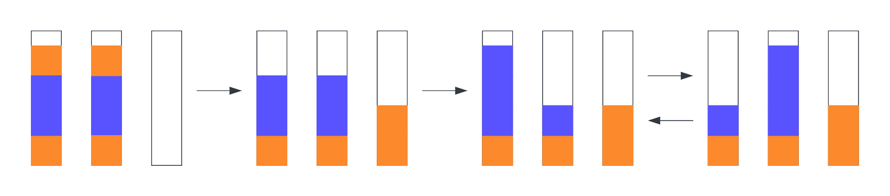

There is a puzzle game that I enjoy playing called "water sort", and it involves sorting colored liquids into containers. There are a lot of different versions out there and you can probably find several different versions for iOS and Android and [even browser based](1)
The game is simple, but it can be difficult to solve. I thought it would be a fun project to try and write a program that can solve the game for me.

In water sort, you have a set of containers with different colored liquids in them. The goal is to sort the liquids into containers of the same color. You can only move one liquid at a time, and you can only move a liquid onto an empty container or onto a container with the same color liquid in it.
Each container holds at maximum 4 units of liquid.


_The example above shows the solution to a problem with 3 flasks and two colors. You can see that the problem is solved by pouring the liquids back and forth until we end up with two containers of the same color._

My first step is to represent the problem as a data structure. To do this, I assign each color to a constant, and then arrange those constant values in an array to represent a container. The beginning of the array represents the bottom of the container, and the end of the array represents the top of the container. Empty containers are represented by an empty array.
I then add the containers to an array to represent the entire problem.

```javascript
const BLUE = 0
const ORANGE = 1

const problem = [[ORANGE, BLUE, ORANGE, BLUE], [BLUE, ORANGE, BLUE, ORANGE], []]
```

By representing the problem as a data structure, I can easily manipulate it with code. For example, I can move a liquid from one container to another by removing it from the end of one array and adding it to the end of another array. I can also check if a container is empty by checking if its array is empty. Because the game has a concept of "pouring" liquids on top of each other, you never add to the beginning of the array or modify a value other than the last one, making this a simple data structure to work with.

Before I can write code that will solve the problem, I need to some utility functions. The first one is `isSolved`, which checks if the problem is solved. This is done by checking if all the containers are empty or if all the containers have the same color liquid in them.

```javascript
const isSolved = containers => {
  for (let i = 0; i < containers.length; i++) {
    // If any container is not empty and not full, the problem is not solved
    if (containers[i].length !== 0 && containers[i].length !== 4) {
      return false
    }
    // If the container contains at least two colors that are not the same, the problem is not solved
    const color = containers[i][0]
    if (containers[i].some(c => c !== color)) {
      return false
    }
  }
  // If none of the above conditions are met, the problem is solved
  return true
}
```

I'll also need a function for pouring one container into another. This is done by removing the last element from one container and adding it to the end of another container. Pouring continues until the source container is empty, another color is reached, or the destination container is full.
For the condition where we continue pouring units of the same color, I simply call the function recursively.

```javascript
const pour = (containers, source, target) => {
  // If the source container is empty, there is nothing to pour
  if (containers[source].length === 0) {
    return containers
  }
  // If the target container is full, there is nothing to pour
  if (containers[target].length === 4) {
    return containers
  }
  // Create a simple copy of the containers array
  const newcontainers = containers.map(tube => tube.slice())
  // Remove the last element from the source container
  const color = newcontainers[source].pop()
  // Push it onto the target container
  newcontainers[target].push(color)
  // If the next element in the source container is the same color, pour again
  if (newcontainers[source][newcontainers[source].length - 1] === color) {
    return pour(newcontainers, source, target)
  } else {
    return newcontainers
  }
}
```

With my code so far, I can represent the game state, pour liquid from one container to another, and check if I've won or not, nice!

Now I need to write code that can determine what possible moves I can make. To put it another way, given a container, what other containers can I pour it into? This is actually a harder problem then it first appears, and the reason for this is that there are a number of game states, where a legal move can be made, but it doesn't advance the game. For example, if I have a container with two colors in it, and I pour it into an empty container, I haven't changed the game state at all. I need to be able to detect these situations and ignore them. When I initially built my solver, I hadn't considered this, and it would get stuck in an infinite loop!



_The figure above shows how you can end up in a state where legitimate moves are made, but the game will loop infinitely_

```javascript
const pourTargets = (containers, source) => {
  const sourceClone = containers[source].slice().reverse()
  const color = containers[source][containers[source].length - 1]
  if (!color) {
    return []
  }
  let num = 0
  for (const hue of sourceClone) {
    if (hue === color) num++
    else break
  }
  const secondColor = containers[source][containers[source].length - 2]
  const stackedColor = color === secondColor
  const targets = []
  for (let j = 0; j < containers.length; j++) {
    if (source === j) continue
    if (containers[j].length === 4) continue
    if (containers[j].length === 0) {
      // This avoids the situation where you pour a stack of colors into an empty tube back and forth
      if (containers[source].every(c => c === color)) continue

      targets.push(j)
      continue
    }
    const comparator1 = containers[j][containers[j].length - 1]
    const comparator2 = containers[j][containers[j].length - 2]
    // This avoids the situation where you continually pour the same color back and forth
    if (color === comparator1) {
      // This avoids the situation where you pour a stack of colors into a tube an leave some color remaining
      if (num + containers[j].length > 4) continue
      if (comparator2 && stackedColor && comparator1 === comparator2) continue

      targets.push(j)
    }
  }

  return targets
}
```

The code above is a bit complicated, but it's not too bad. The first thing I do is create a clone of the source container. I then count how many units of the same color are in the container. This is important because I don't want to pour a stack of colors into a container and have leftovers (one of the failure modes we can hit). I then loop through all the containers and check if I can pour into them. If the container is empty, I check if the source container is all the same color. If it is, I skip it. This avoids the situation where you pour a stack of colors into an empty container back and forth. I then check if the last element in the target container is the same color as the source container. If it is, I check if the second to last element is the same color. If it is, I skip it. This avoids the situation where you continually pour the same color back and forth. I also check if the target container is full. If it is, I skip it. Finally, I check if the number of units of the same color in the source container plus the number of units in the target container is greater than 4. If it is, I skip it. This avoids the situation where you pour a stack of colors into a container and leave some color remaining.

Phew, this is probably some of the hardest logic so far. I'm glad I got it working! The next step is to write the code that can search for the solution. At each step of the game, we can have multiple options to choose from, that can lead to different outcomes. We need to search all of these options to find the solution. If we mapped all the possible moves we would have a tree of different game states, where each state branches into one or more new states, until we either win, lose or arrive in a looping scenario. Searching tree-like data structures is a classic problem in computer science, and for this problem I chose to use an approach called [depth-first search](https://en.wikipedia.org/wiki/Depth-first_search). This is an algorithm that starts at the root node and explores as far as possible along each branch before backtracking. I chose this approach because it's simple to implement, and I don't need to worry about the performance of the algorithm. I'm not searching a large tree, so I don't need to worry about optimizing the search.

```javascript
const isGameOver = containers => {
  for (let i = 0; i < containers.length; i++) {
    if (pourTargets(containers, i).length > 0) return false
  }
  return true
}

const runDFS = containers => {
  // Validate the input containers
  for (const container of containers) {
    if (container.length > 4) {
      throw new Error('Invalid containers, size cannot be greater than 4')
    }
  }
  const initialcontainers = containers

  // Use a stack for DFS, and initialize it with the initial state
  const stack = [{ containers: initialcontainers, moves: [] }]
  while (stack.length > 0) {
    const { containers, moves } = stack.pop()
    if (isGameOver(containers)) continue

    for (let i = 0; i < containers.length; i++) {
      const targets = pourTargets(containers, i)
      for (let j = 0; j < targets.length; j++) {
        const newcontainers = pour(containers, i, targets[j])
        const newMoves = [...moves, { from: i, to: targets[j] }]

        if (isWin(newcontainers)) {
          console.log(newMoves)
          return
        }

        stack.push({ containers: newcontainers, moves: newMoves })
      }
    }
  }
  console.log('No solution found')
  console.log(JSON.stringify(stack.pop().moves, null, 2))
}
```

Now I can call `runDFS` with the initial state of the game, and it will search for a solution. If it finds one, it will print it to the console. If it doesn't find one, it will print a message saying so. The output will be a series of instructions stating which container to pour from and what container to pour into, which I can then follow to win the game.

Using our initial problem:

```javascript
const problem = [[ORANGE, BLUE, ORANGE, BLUE], [BLUE, ORANGE, BLUE, ORANGE], []]
runDFS(problem)
```

I get the following output:

```sh
[
  { from: 1, to: 2 },
  { from: 0, to: 1 },
  { from: 2, to: 0 },
  { from: 1, to: 2 },
  { from: 0, to: 1 },
  { from: 2, to: 0 },
  { from: 1, to: 2 },
  { from: 0, to: 1 },
  { from: 0, to: 2 }
]
```

Note that the containers are zero-indexed here, so `0` would be the first container.
I can now follow these instructions step-by-step to solve the water-sort problem.

What's next? Although the logic is sound, setting up the game state and then following the solution is really awkward and error-prone. I'd really like to be able to streamline this process by adding a UI for the solver, but thats a problem for another post!

[1]: https://html5.gamedistribution.com/rvvASMiM/d77896c3e7e443b7b48ead37718d7b01/index.html?gd_sdk_referrer_url=https%3A%2F%2Fwww.crazygames.com%2Fgame%2Fwater-sort-puzzle&gd_zone_config=eyJwYXJlbnRVUkwiOiJodHRwczovL3d3dy5jcmF6eWdhbWVzLmNvbS9nYW1lL3dhdGVyLXNvcnQtcHV6emxlIiwicGFyZW50RG9tYWluIjoiY3JhenlnYW1lcy5jb20iLCJ0b3BEb21haW4iOiJjcmF6eWdhbWVzLmNvbSIsImhhc0ltcHJlc3Npb24iOmZhbHNlLCJsb2FkZXJFbmFibGVkIjp0cnVlLCJob3N0IjoiaHRtbDUuZ2FtZWRpc3RyaWJ1dGlvbi5jb20iLCJ2ZXJzaW9uIjoiMS41LjE2In0%253D

```

```

```

```
