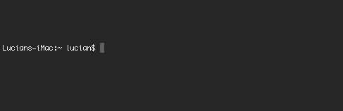
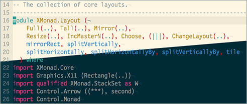
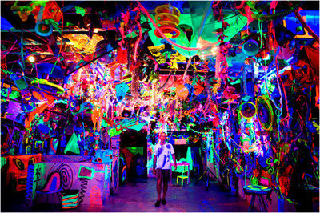

I spend a lot of my time at work using Terminal. Connecting to servers,
managing version control and editing files (I'm a [Vim][0] user). Learning how
to use Terminal can be really powerful for a full stack developer, but opening
up the app and seeing the default interface doesn't exactly shout *"Use me! I'm
awesome!"*.

It's pretty drab (even if your using the snazzy *Pro* theme shown above), the
font is spidery, pixelated and hard to read and the information being
shown to me in the prompt is pretty useless as well.
Clearly this kind of display is potentially useful to some people - but it
is doing nothing for me 99% of the time apart from causing me to make a sort of
"bleugghh" noise at the back of my throat.

After my first few tussles with Terminal I saw that it was a great (some may say
essential) tool, despite the unappealing interface.
I decided to spend the morning making a few teaks, and sat down in front of my
computer with 3 goals in mind.

1. Make the colour more interesting.
2. Use a more stylish typeface that's hopefully more legible.
3. Display a more informative and useful prompt.

This was many years ago and "a few teaks" has turned into a weird and interesting
adventure into the land of command line customisation that I doubt will ever end.

I'm of the opinion that **bespoke** = **better**. A tailor made suit is
always going to be more wearable than something off the shelf at Primark. If I'm
going to be using a piece of software for 30 hours a week or more, it's got to
be right for **me**.
Developers are part craftsperson and part writer. Like the writer, much of the job we do is
confined to our own heads. However, unless we choose and maintain the right
tools for ourselves we will end up working twice as hard for half the
productivity.

In this article I'd like to explain what I've done to meet my 3 initial goals
and hopefully inspire you to modify your working environment to meet **your**
needs.

The colourscheme
----------------

Ok, I know that picking a colour may seem like the least important part of
customizing software but getting the colour right on something is low hanging
fruit. The right colourscheme can make an immediate and profound difference to your experience.
That being said, getting your colours right in software that your going to be reviewing
or editing code in can be a little tricky. Syntax highlighting, comment colours
and linters all require speific contrasting colours to be able to work
effectively.
It's pretty easy to modify colours in Terminal's preferences window, but I was
keen to leverage a pre-existing colour palette that had been designed for code
and hopefully avoid the aforementioned syntax/comment/linter headache.
I forget where I first saw it, but I've been in love with Ethan Schnoover's
[Solarized][2] theme for a long time. There are Solarized themes available as
downloads for both Terminal and Vim, making it very easy to setup.

>"[The theme has been designed] *with both precise [CIELAB][3] lightness
relationships and a refined set of hues based on fixed colour wheel relationships.*"

A lot of thought has been put into this colour palette and it shows. The beige
might not be to everyone's taste but it's great to still be
able to read my screen at 3am because my IDE **doesn't look like this:**

If you'd like to explore more themes, take a look at [terminal.sexy][4]. Don't be put
of by the dubious sounding URL, it's a web app that allows you to create, preview
and share Terminal themes. Themes can be downloaded as an XML
file and imported it into Terminal through the preferences window.
One "gotcha" with this process is that the file can't be imported unless you
change the file extension to `.terminal`.

The font
--------

Like the colourscheme, I thought this would be a quick win, but I didn't have the
Solarized magic bullet.
Changing the font used in Terminal is as simple as opening the preferences and
clicking `change` under the font header. Unfortunately the choice of fonts
presented here that are suitable for code editing is rather limited.
Luckily there's a plethora of fonts available for download on the web and this
quickly opened up my options.

My font of choice was chopping and changing
pretty regularly until I came across the fantastic [Airline][6] plugin for Vim.
Airline looks a bit weird (due to missing characters) unless you use one of
the 14 patched typefaces in the [Powerline fonts][7] repository on github. After
playing around with them I ended up using [Droid sans mono][8].
Its chunky, reads well and as an Android owner and Google fanboy I feel right at home.

[0]: https://jaxbot.me/articles/why-i-use-vim
[1]: http://markdotto.com/2012/10/18/terminal-hotness/
[2]: http://ethanschoonover.com/solarized
[3]: http://en.wikipedia.org/wiki/Lab_colour_space
[4]: http://terminal.sexy/
[5]: http://en.wikipedia.org/wiki/Analysis_paralysis
[6]: https://github.com/bling/vim-airline
[7]: https://github.com/powerline/fonts
[8]: http://www.google.com/fonts/specimen/Droid+Sans+Mono
[9]: http://markdotto.com/2013/01/13/improved-terminal-hotness/
[10]: https://gist.github.com/clozed2u/4971506#file-gistfile1-sh
[11]: http://bitmote.com/index.php?post/2012/11/19/Using-ANSI-Color-Codes-to-Colorize-Your-Bash-Prompt-on-Linux
[12]: http://ethanschoonover.com/solarized#the-values
[13]: http://stackoverflow.com/
[14]: http://www.tldp.org/HOWTO/Bash-Prompt-HOWTO/bash-prompt-escape-sequences.html
[15]: http://www.cyberciti.biz/faq/linux-change-hostname/
