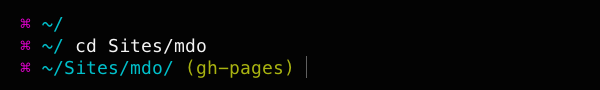

My prompt remained largely unchanged for a long time until I came across
[this article][1] written by the excellent Mark Otto (of Twitter bootstrap fame).
In the article he provides a code snippet for your `.bash_profile` to turn your
standard prompt into this:



I loved it and started using it myself straight away. Unfortunately there were a
few issues with it. The prompt would fragment or completely disappear when cycling up or
down through my command history and I encountered horrible line wrapping issues.

The issues were mostly resolved in a [later article][9] and solved entirely by
[this lovely gist][10]. The follow up included code that would *change the colour
of your working git branch depending on its status*.

This seemingly insignificant feature is incredibly useful. I'm constantly
reminded to commit my work, resulting in frequent, small commits rather than
behemoths where I've completely forgotten when, why and what code I've changed.

I coloured the prompt with the help of [this wonderful][11] article by Michael
Plotke and the [colour value table][12] on the Solarized site. Here is a basic
but handy script I made for displaying the colours.
(the value need for Terminal is the XTERM column)

```bash
#!/bin/bash
#
# generates an 8 bit color table (256 colors) showing the colors used by
# Ethan Schnoover's Solarized theme

printf "\nSWATCH SOLARIZED HEX     16/8 TERMCOL  XTERM/HEX   L*A*B      RGB         HSB        "
printf "\n------ --------- ------- ---- -------  ----------- ---------- ----------- -----------"
printf "\n\033[48;5;234m      \033[m base03    #002b36  8/4 brblack  234 #1c1c1c 15 -12 -12   0  43  54 193 100  21"
printf "\n\033[48;5;235m      \033[m base02    #073642  0/4 black    235 #262626 20 -12 -12   7  54  66 192  90  26"
printf "\n\033[48;5;240m      \033[m base01    #586e75 10/7 brgreen  240 #585858 45 -07 -07  88 110 117 194  25  46"
printf "\n\033[48;5;241m      \033[m base00    #657b83 11/7 bryellow 241 #626262 50 -07 -07 101 123 131 195  23  51"
printf "\n\033[48;5;244m      \033[m base0     #839496 12/6 brblue   244 #808080 60 -06 -03 131 148 150 186  13  59"
printf "\n\033[48;5;245m      \033[m base1     #93a1a1 14/4 brcyan   245 #8a8a8a 65 -05 -02 147 161 161 180   9  63"
printf "\n\033[48;5;254m      \033[m base2     #eee8d5  7/7 white    254 #e4e4e4 92 -00  10 238 232 213  44  11  93"
printf "\n\033[48;5;230m      \033[m base3     #fdf6e3 15/7 brwhite  230 #ffffd7 97  00  10 253 246 227  44  10  99"
printf "\n\033[48;5;136m      \033[m yellow    #b58900  3/3 yellow   136 #af8700 60  10  65 181 137   0  45 100  71"
printf "\n\033[48;5;166m      \033[m orange    #cb4b16  9/3 brred    166 #d75f00 50  50  55 203  75  22  18  89  80"
printf "\n\033[48;5;160m      \033[m red       #dc322f  1/1 red      160 #d70000 50  65  45 220  50  47   1  79  86"
printf "\n\033[48;5;125m      \033[m magenta   #d33682  5/5 magenta  125 #af005f 50  65 -05 211  54 130 331  74  83"
printf "\n\033[48;5;61m      \033[m violet    #6c71c4 13/5 brmagenta 61 #5f5faf 50  15 -45 108 113 196 237  45  77"
printf "\n\033[48;5;33m      \033[m blue      #268bd2  4/4 blue      33 #0087ff 55 -10 -45  38 139 210 205  82  82"
printf "\n\033[48;5;37m      \033[m cyan      #2aa198  6/6 cyan      37 #00afaf 60 -35 -05  42 161 152 175  74  63"
printf "\n\033[48;5;64m      \033[m green     #859900  2/2 green     64 #5f8700 60 -20  65 133 153   0  68 100  60"
printf "\n"
```

I was feeling pretty happy with myself at this point; the colourscheme was great,
the font was inviting and my bash prompt looked cool and was actually useful to me.

[0]: https://jaxbot.me/articles/why-i-use-vim
[1]: http://markdotto.com/2012/10/18/terminal-hotness/
[2]: http://ethanschoonover.com/solarized
[3]: http://en.wikipedia.org/wiki/Lab_colour_space
[4]: http://terminal.sexy/
[5]: http://en.wikipedia.org/wiki/Analysis_paralysis
[6]: https://github.com/bling/vim-airline
[7]: https://github.com/powerline/fonts
[8]: http://www.google.com/fonts/specimen/Droid+Sans+Mono
[9]: http://markdotto.com/2013/01/13/improved-terminal-hotness/
[10]: https://gist.github.com/clozed2u/4971506#file-gistfile1-sh
[11]: http://bitmote.com/index.php?post/2012/11/19/Using-ANSI-Color-Codes-to-Colorize-Your-Bash-Prompt-on-Linux
[12]: http://ethanschoonover.com/solarized#the-values
[13]: http://stackoverflow.com/
[14]: http://www.tldp.org/HOWTO/Bash-Prompt-HOWTO/bash-prompt-escape-sequences.html
[15]: http://www.cyberciti.biz/faq/linux-change-hostname/
