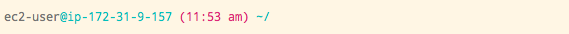
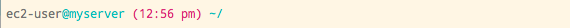

After improving the prompt in my terminal I was pretty happy with it (see [part
2 of this series][./terminal-improvement-2]), unfortunately as soon as I fired
up an SSH session I was seeing the "bleurgh" prompt again.


Getting around this problem wasn't too hard, I set up a git repository for all
my dot files (`.vimrc`, `.bash_profile`, etc) and created a bash script to
symlink the files to my home directory. Now all I had to do was `git clone` and
run my setup script and I could have the same prompt (and Vim config) in my SSH.

"Lovely" I thought to myself, but now my SSH session looks exactly the same as
my normal Terminal session, how am I going to be able to tell the difference?
What if I accidentally kill a production server because I got confused?


Solving this problem came in two parts.

Firstly, I needed to be able to differentiate between a "normal" session and an
SSH session. I did some digging on [stackoverflow][13] and found this little gem.

```bash
function is_ssh() {
  if [ -n "$SSH_CLIENT" ] || [ -n "$SSH_TTY" ]; then
    return 0
  # many other tests omitted
  else
    case $(ps -o comm= -p $PPID) in
      sshd|*/sshd) return 0;;
    esac
  fi
  return 1
}
```

The function detects SSH environment variables and will return `true` if they are
available (indicating an SSH session is active).

Secondly, I needed to be able to change the output of my prompt based on what type
of session I'm in. This was fairly straight forward to cobble together. I
created a function that returns a prompt based on the result of `is_ssh` and
then assigned it to `export PS1`.

```bash
function get_prompt {
  c="\[\033["
  p="${c}38;5;136\]"

  local_session='\[\033[38;5;240m\]ಠ_ಠ\[\e[m\] \[\033[38;5;37m\]\W/\[\e[m\]\[$(git_color)\]$(git_branch)\[\033[m\] '
  ssh_session='\[\033[38;5;240m\]\u\[\033[38;5;37m\]@\h\[\em\]\[\033[38;5;125m\] (\@)\[\em\]\[\e[m\] \[\033[38;5;37m\]\W/\[\e[m\]\[$(git_color)\]$(git_branch)\[\033[m\] '

  n="${c}m]"
  if is_ssh; then
    echo -e "${ssh_session}"
  else
    echo -e "${local_session}"
  fi
}

export PS1=$(get_prompt)
```

The prompt returned by the function when I'm in an SSH session shows the standard
`user@host` ( `\u@\h` ) as well as the current time ( `\@` ).
Now I can quickly see if I'm on a remote machine and ensure that no horrible
command line related accidents happen!



One thing still bugged me about this prompt though. The host name `ip-172-31-9-157`
is pretty useless to me. I, like many other developers and sysadmins out there, use a
host config file to create aliases for the machine I work on. A typical entry in
this file looks like this:

    Host myserver
      Hostname 123.45.6.78
      User ec2-user
      IdentityFile ~/path/to/some/private/key

With this config file I can connect to a machine by typing `ssh myserver` instead of
`ssh ec2-user@123.45.6.78`. If I could get the prompt to display the alias
I had set then I would definitely know which server I was one. However this is
much easier said than done and coming up with a clean method of doing it proved
to be a bit tricky.

One option would be to [change the hostname][15] within the machine itself, however
this was something I wanted to avoid for a number of reasons.

- Setting up a hostname on each machine I work on would be massively time consuming and pretty
boring.
- If I ever changed my local alias I'd have to update the machines hostname.
- If a team mate logged onto a server it could cause problems for them.

What I needed was an approach that involved as little setup as possible, that left
the machines hostname untouched and could update dynamically based on my local
config.

The solution I came up with feels like a bit of a hack but has been working
without issue.
In essence, I use the `[command]` parameter of `ssh` to set a Bash variable
and then open a new bash session before the SSH connection closes.
I created a function in my `.bash_profile` called **tunnel** that wraps the ssh command and adds
arguments, passing my hostname alias through the `[command]` parameter.

```bash
function tunnel {
  local HOSTALIAS="'export MYHOSTALIAS=$1; /bin/bash -il'"
  ssh "$@" -t \'"$HOSTALIAS"\'
}
```

In the ssh session bash prompt I replaced the ["escape sequence"][14] for the current
machines hostname (`\h`) with a function call. This function will return the
the value of the variable `MYHOSTALIAS` or the current machines hostname if it
isn't available.

```bash
function host_alias {
  if [ -z "$MYHOSTALIAS" ]; then
    echo -e $(hostname -s)
  else
    echo $MYHOSTALIAS
  fi
}
```

The resulting prompt string now looks like this:

```bash
ssh_session='\[\033[38;5;240m\]\u\[\033[38;5;37m\]@$(host_alias)\[\em\]\[\033[38;5;125m\] (\@)\[\em\]\[\e[m\] \[\033[38;5;37m\]\W/\[\e[m\]\[$(git_color)\]$(git_branch)\[\033[m\] '
```

And the rendered bash prompt now looks like this:



Now I have no problem seeing which server I'm on and I'm not going to be annoying
any co-workers!

My Terminal *feels* right for me, it's really only cosmetic differences that
i've discussed but it's had a huge difference on my user experience.
By making the software my own I've ended up with something that
I actually enjoy using and my work is that much better for it.

[0]: https://jaxbot.me/articles/why-i-use-vim
[1]: http://markdotto.com/2012/10/18/terminal-hotness/
[2]: http://ethanschoonover.com/solarized
[3]: http://en.wikipedia.org/wiki/Lab_colour_space
[4]: http://terminal.sexy/
[5]: http://en.wikipedia.org/wiki/Analysis_paralysis
[6]: https://github.com/bling/vim-airline
[7]: https://github.com/powerline/fonts
[8]: http://www.google.com/fonts/specimen/Droid+Sans+Mono
[9]: http://markdotto.com/2013/01/13/improved-terminal-hotness/
[10]: https://gist.github.com/clozed2u/4971506#file-gistfile1-sh
[11]: http://bitmote.com/index.php?post/2012/11/19/Using-ANSI-Color-Codes-to-Colorize-Your-Bash-Prompt-on-Linux
[12]: http://ethanschoonover.com/solarized#the-values
[13]: http://stackoverflow.com/
[14]: http://www.tldp.org/HOWTO/Bash-Prompt-HOWTO/bash-prompt-escape-sequences.html
[15]: http://www.cyberciti.biz/faq/linux-change-hostname/
