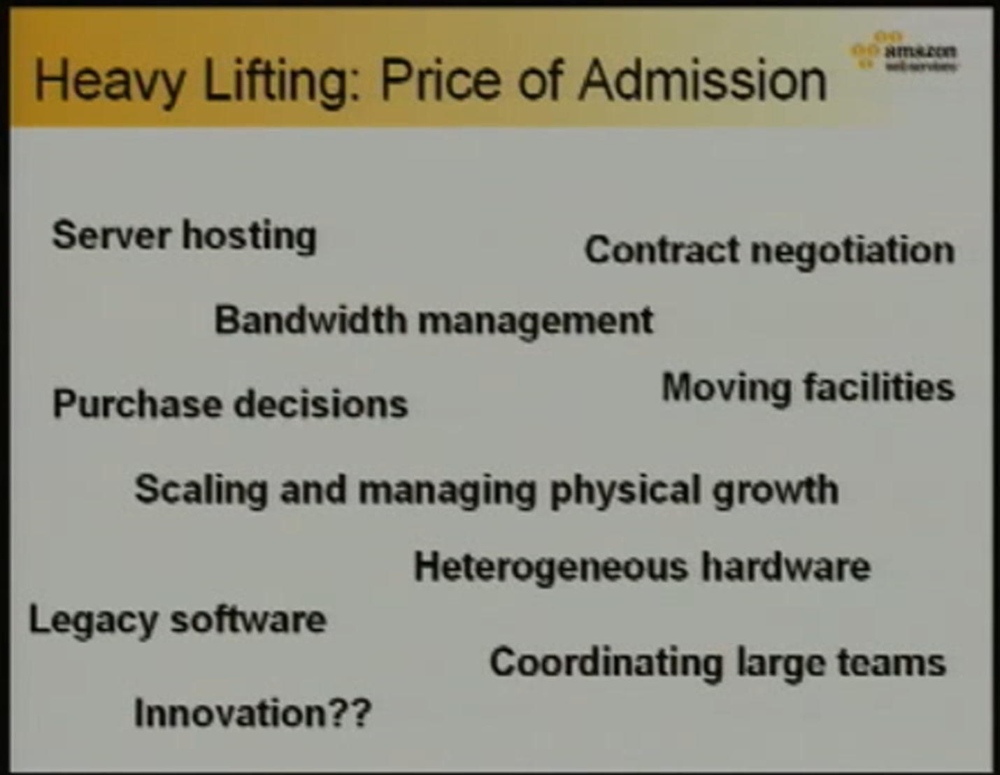

In 2006, Jeff Bezos gave [a keynote speech at MIT](https://techtv.mit.edu/videos/16180-opening-keynote-and-keynote-interview-with-jeff-bezos), where he introduced the concept of "Undifferentiated Heavy Lifting." In this address, Bezos discussed the challenging and often unseen tasks associated with managing a digital platform, which online business owners must confront. While these tasks may not directly contribute to the value of the online enterprise, they are essential for operating a thriving internet-based company ("the price of admission"). Failing to execute these tasks effectively can lead to the downfall of the business.

As Amazon grew, they were building out all the infrastructure that amazon.com needed to run on, and looking for ways to make it easier to launch new projects and support their customers. The majority of the work they were doing was not unique to Amazon, or even to a particular project within Amazon, and they were spending a lot of time and effort on tasks that were not directly related to their core business.
Amazon Web Services, or [AWS](https://aws.amazon.com/), was born out of this need to reduce the amount of time and effort spent on these tasks: an effort to remove undifferentiated heavy lifting, by providing off-the-shelf cloud-computing services. Initially starting as an internal tool, AWS [was eventually spun out into a separate business](https://aws.amazon.com/), becoming hugely successful and reducing the barrier-to-entry for new web businesses by an order of magnitude.

## What is Undifferentiated Heavy Lifting?

Undifferentiated heavy lifting (or UHL) refers to any non-core task that is required to create and maintain software applications. These tasks are generally repetitive, time-consuming, and require a significant amount of effort to complete. The work is “Undifferentiated” because it is not unique to a particular application or business, and the term “heavy lifting” refers to the amount of effort required to complete these tasks.
Some common examples of UHL in software development include:

* **Infrastructure setup and management:** Setting up and maintaining infrastructure, including servers, load balancers, and databases.
* **Monitoring and logging:** Monitoring applications for errors and performance issues, and logging relevant data for analysis.
* **Security and compliance:** Ensuring that applications are secure and compliant with relevant regulations and standards.

However, UHL also includes software development tasks that are not unique to your application. For example, if you write your own logging solution instead of using a third-party provider or library, this would be considered UHL.

## Why is it a Problem?

Whenever we spend time working on tasks that are not directly related to our core business, we are wasting time and resources. When developing a software application, we should be aiming to spend the bulk of our time working on the tasks that are unique to our application and business. In other words, we should be focusing our effort on things that “differentiate” us from the rest of the industry.

While these sorts of tasks are necessary to create and maintain applications, they are problems that have been solved many times before, and are generally repetitive and time-consuming. UHL tasks can end up consuming a significant amount of developer time, which slows down the process and takes energy away from the things that make your application unique and valuable.

Additionally, due to their repetitive and “solved” nature, these tasks do not give developers the opportunity to use their skills and creativity, and they may feel that they are not doing work that is impactful or useful to the business which can lead to disengagement and a decrease in job satisfaction. We should always be aiming to have developers spending their time working on problems that are not already solved!

## Minimizing the Impact of UHL

Fortunately, there are several strategies that development teams can use to minimize the impact of UHL on their work. Some of these strategies include:

### Automation

Automating repetitive tasks can significantly reduce the amount of time and effort required to complete them. For example, deploying and testing applications can be automated using continuous integration and deployment (CI/CD) tools.

At Cerebrum, we use [GitHub actions](https://github.com/features/actions) as a simple way to automate tasks like running tests and deploying applications, whilst easily being able to integrate it into our PR review process. We also use [Terraform](https://www.terraform.io/) and [Helm](https://helm.sh/) to automate the creation and management of our infrastructure. Automation is probably worthy of its own blog post, so I’ll leave it at that for now.

### Outsourcing

Outsourcing UHL tasks to third-party providers can free up internal resources and reduce the burden on development teams. For example, managed database services can handle database setup and management, allowing developers to focus on core development tasks. Perhaps the most obvious example of this is the company that started all of this UHL stuff, Amazon Web Services.

AWS provides out-of-the-box services for just about anything you can think of, from storage with S3 to compute with EC2 to databases with RDS. They also provide more esoteric services like facial recognition and transcription. Rather than maintaining and managing these services ourselves, we can simply use them as a service and focus on the things that make our business unique.

Outsourcing also often has the effect of reducing the complexity your team has to take on and manage in the long run. Using a service like Courier and maintaining a few lines of code and some environment variables burdens your team with significantly less complexity than maintaining your own email delivery service. This leads to a much smaller surface area for bugs and security vulnerabilities, and it also means that you don’t have to worry about things like scaling and high availability. Instead this complexity is offloaded to the provider, who have resources and expertise dedicated to dealing with it.

### Standardization

Standardizing development processes and tools can make UHL tasks more efficient and reduce the amount of time required to complete them. By adhering to standard processes we can also take advantage of standard tools that support them and have been developed by other teams and/or are supported by a wider community. 

A good example of this would be using [JSON schema](https://json-schema.org/) instead of developing your own schema for validating JSON data. This allows you to take advantage of the tools and libraries that have been developed to support JSON schema, and also allows you to benefit from the community support and documentation that is available for JSON schema. Critically it also removes the burden of having to develop the schema yourself, which is a UHL task.

The same principle applies to things like project management doctrine as well - using well tried-and-true methodologies for organizing your work such as kanban or scrum means you can use off the shelf tooling that supports it, as well as having access to a wealth of guides and documentation that can help you get started.

It is important to cast a critical eye on any task you are doing regularly that is non-standard. Ask yourself “Why does this need to be special?”, if you can’t make a convincing argument for why it needs to be special, then it probably isn’t special and you should standardize it.

### Open Source

Occasionally it is necessary to develop a custom solution to a problem, and when this happens it is important to consider whether or not this solution could be useful to other teams. If so, it may be worth open sourcing it so that other teams can benefit from it. This can be a great way to reduce the amount of UHL work that needs to be done by other teams, and it can also be a great way to build a community around your product and get feedback and contributions from other developers. 

At Cerebrum we identified a need for a robust and flexible RBAC solution that we could apply to our Prisma projects, so we developed [Yates](https://github.com/cerebruminc/yates) and released it as an open source project. By doing this, we’ve taken work that could be considered undifferentiated heavy lifting and turned it into something that is an asset to our business and the community. These sorts of efforts create a virtuous cycle where the more you contribute to the community, the more you get back from it.

## Conclusion

In summary, undifferentiated heavy lifting (UHL) refers to the time-consuming and repetitive tasks that are necessary for creating and maintaining software applications but do not directly contribute to the core business. Identifying and minimizing the impact of UHL is essential for optimizing resource allocation and focusing on the unique aspects of your applications. Strategies for mitigating UHL include automation, outsourcing, standardization, and open-sourcing custom solutions. By recognizing and addressing UHL, businesses can enhance productivity, improve employee engagement, and concentrate on what sets them apart in the industry. The benefits of tackling UHL are significant for both the organization and its workforce.